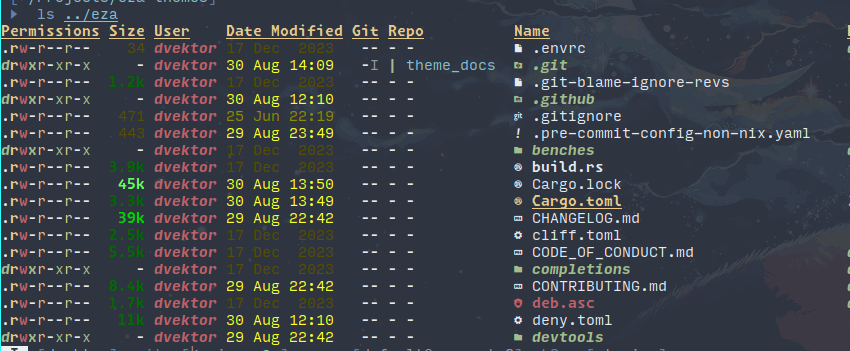

<div align="center">

# eza themes

Themes for [eza](https://github.com/eza-community/eza).

</div>

**DISCLAIMER:** This is work-in-progress and thus still private until the recently
merged theming feature is released and stabilized a bit more. Also we have to
come up with a couple of themes first.

## Themes

- [default](themes/default.yml): Replicates eza's default look.


- [frosty](themes/frosty.yml): Bright and icy tones.


- [black](themes/black.yml): All black everything.


- [white](themes/white.yml): All white everything.


- [gruvbox](themes/gruvbox.yml): Classic bright theme, with warm 'retro groove' colors.



- [catppuccin](themes/catppuccin.yml): [Catppuccin](https://catppuccin.com/palette) theme


## Installation

On Linux, simply clone the repository somewhere and symlink a theme to
`~/.config/eza/theme.yml`:
```sh
git clone https://github.com/eza-community/eza-themes.git
mkdir -p ~/.config/eza
ln -sf "$(pwd)/eza-themes/themes/default.yml" ~/.config/eza/theme.yml
```


## Usage Hints

### Overriding Things

The theme file overrides the default styles, meaning you only need to specify
what you want to change.

### Environment Variables

`EZA_CONFIG_DIR` can be used to specify a custom configuration directory.
Also, `LS_COLORS` and `EZA_COLORS` take precedence over the theme file, so make
sure to unset them when using a theme file.

## Specification

### General
TODO

### Style
TODO

### Color
TODO

### File- and Extension-Based Overrides
TODO
