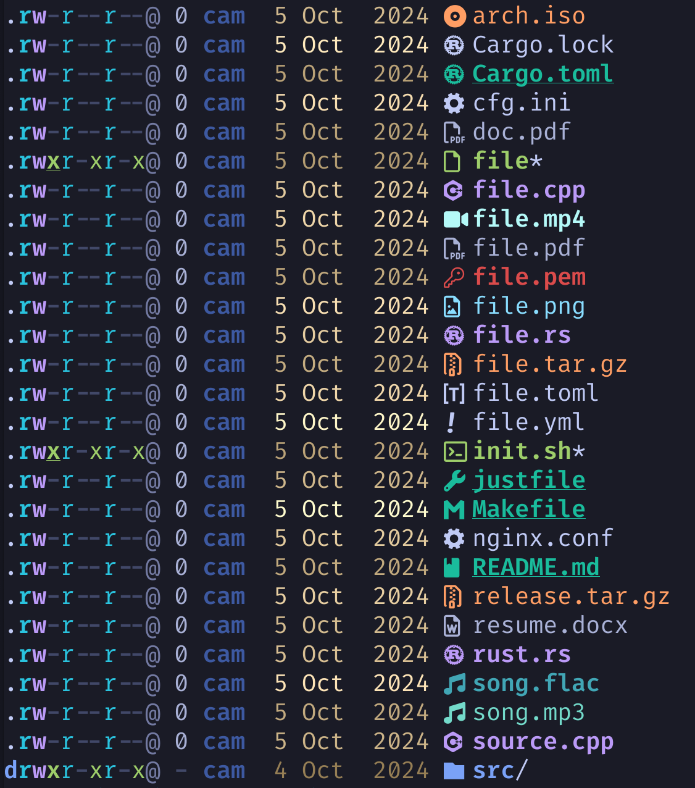

<div align="center">

# eza themes

Themes for [eza](https://github.com/eza-community/eza).

</div>


## Themes

- [default](themes/default.yml): Replicates eza's default look.


- [frosty](themes/frosty.yml): Bright and icy tones.


- [black](themes/black.yml): All black everything.


- [white](themes/white.yml): All white everything.


- [gruvbox-dark](themes/gruvbox-dark.yml): Classic bright theme, with warm 'retro groove' colors.


- [catppuccin](themes/catppuccin.yml): Smooth pastel theme [Catppuccin](https://catppuccin.com/palette)


- [onedark](themes/one_dark.yml): OneDark theme of `Atom` fame.


- [dracula](themes/dracula.yml): [Dracula](https://draculatheme.com/contribute#color-palette) theme


- [gruvbox-light](themes/gruvbox-light.yml): a `gruvbox` theme for light mode


- [tokyonight](themes/tokyonight.yml): A [Tokyonight](https://github.com/folke/tokyonight.nvim) theme



- [Rosé Pine](themes/rose-pine.yml): All natural pine, faux fur and a bit of soho vibes for the classy minimalist. Created with the main [Rosé Pine](https://github.com/rose-pine/rose-pine-theme) palette.


- [Rosé Pine Dawn](themes/rose-pine-dawn.yml): All natural pine, faux fur and a bit of soho vibes for the classy minimalist. Created with the [Rosé Pine Dawn](https://github.com/rose-pine/rose-pine-theme) palette.


- [Rosé Pine Moon](themes/rose-pine-moon.yml): All natural pine, faux fur and a bit of soho vibes for the classy minimalist. Created with the [Rosé Pine Moon](https://github.com/rose-pine/rose-pine-theme) palette.


## Installation

On Linux, simply clone the repository somewhere and symlink a theme to
`~/.config/eza/theme.yml`:
```sh
git clone https://github.com/eza-community/eza-themes.git
mkdir -p ~/.config/eza
ln -sf "$(pwd)/eza-themes/themes/default.yml" ~/.config/eza/theme.yml
```

**MacOS**: on MacOS, `eza` will look for the theme file in `~/Library/Application Support/eza` by default. That directory can be overridden by setting `EZA_CONFIG_DIR`.

**PowerShell**: create the config folder with the theme file or a link to it under USERPROFILE and put `$env:EZA_CONFIG_DIR = "$env:USERPROFILE\.config\eza"` in your PowerShell configuration to direct `eza` to that directory.

## Contributing

Contributions are very welcome! Any improvements you may have to existing themes or any new themes you would 
like to add are welcome and encouraged. Please submit a PR with your changes, making sure to reflect any
changes you made in the README, and please include a screenshot of the proposed theme using the provided
[test directory](test_dir/) to display a wide range of file types.

## Usage Hints

### Overriding Things

The theme file overrides the default styles, meaning you only need to specify
what you want to change.

### Environment Variables

`EZA_CONFIG_DIR` can be used to specify a custom configuration directory.
Also, `LS_COLORS` and `EZA_COLORS` take precedence over the theme file, so make
sure to unset them when using a theme file.


## Specification

### General

The theme files are written in YAML format and define the visual styling for various elements displayed by eza. This includes colors, text styles, and icons for file listings. The theme system allows for extensive customization to match your preferred aesthetic or to integrate with your terminal's color scheme.

Each theme consists of several sections that correspond to different aspects of the file listing output. These sections include:

    filekinds: Styles for different types of files (e.g., directories, symlinks).
    perms: Styles for file permissions.
    size: Styles for file sizes.
    users: Styles for user and group names.
    links: Styles for hard links and symlinks.
    git: Styles for Git status indicators.
    git_repo: Styles for Git repository information.
    security_context: Styles for security contexts (e.g., SELinux).
    file_type: Styles based on file types (e.g., images, videos).
    punctuation, date, inode, blocks, header, octal, flags: Styles for miscellaneous elements.
    filenames: Overrides for specific filenames.
    extensions: Overrides for specific file extensions.

### Style

For each element in the theme file, you can define various style properties:

    Colors:
        foreground: Sets the text color.
        background: Sets the background color.
    Text Attributes:
        is_bold: Makes the text bold.
        is_dimmed: Dims the text color.
        is_italic: Italicizes the text.
        is_underline: Underlines the text.
        is_blink: Makes the text blink (note: may not be supported in all terminals).
        is_reverse: Swaps foreground and background colors.
        is_hidden: Hides the text (useful for suppressing output).
        is_strikethrough: Adds a strikethrough to the text.
    Special Options:
        prefix_with_reset: Resets all styles before applying the new ones. Useful to prevent style bleeding from previous elements.

Example:

```yaml

filekinds:
  directory:
    foreground: Blue
    is_bold: true
  symlink:
    foreground: Cyan
    is_italic: true
```

### Color

Colors can be specified using either standard color names or hexadecimal color codes.

    Standard Colors:
        Basic colors: Black, Red, Green, Yellow, Blue, Magenta, Cyan, White
        Bright variants: BrightBlack, BrightRed, etc.
    Hexadecimal Color Codes:
        Format: "#RRGGBB"
        Example: foreground: "#83a598"

Example using named colors:

```yaml

size:
  number_byte:
    foreground: White
  unit_byte:
    foreground: BrightBlack
```

Example using hex codes:

```yaml

git:
  new:
    foreground: "#b8bb26"  # Gruvbox green
  modified:
    foreground: "#fabd2f"  # Gruvbox yellow
```

### File- and Extension-Based Overrides

You can customize the appearance and icons for specific filenames or file extensions, allowing for granular control over how certain files are displayed.
Filenames

To override styles for specific filenames:

```yaml

filenames:
  "Makefile":
    filename:
      foreground: Red
      is_bold: true
    icon:
      glyph: ⚙️
      foreground: Red
```
In this example, any file named Makefile will have red, bold text and a gear icon in red.
Extensions

To override styles for specific file extensions:

```yaml

extensions:
  "md":
    filename:
      foreground: Blue
    icon:
      glyph: 📘
      foreground: Blue
```

Files with the .md extension will have blue text and a blue book icon.
Icons

Icons can be customized by specifying the glyph and optional style attributes:

```yaml

filenames:
  "Dockerfile":
    icon:
      glyph: 🐳
      foreground: Cyan
```

Notes:

    Not all glyphs support color changes due to font limitations.
    Ensure your terminal font supports the glyphs you choose to avoid display issues.

Additional Notes

    Syntax Checking: If your theme isn't working as expected, double-check your YAML syntax. A syntax error can cause multiple properties to fail.
    File Naming: The theme file must be named theme.yml, regardless of its directory.
    Colorful Flag: At the top of the theme file, the colourful flag can be set to true or false to enable or disable color output globally.
